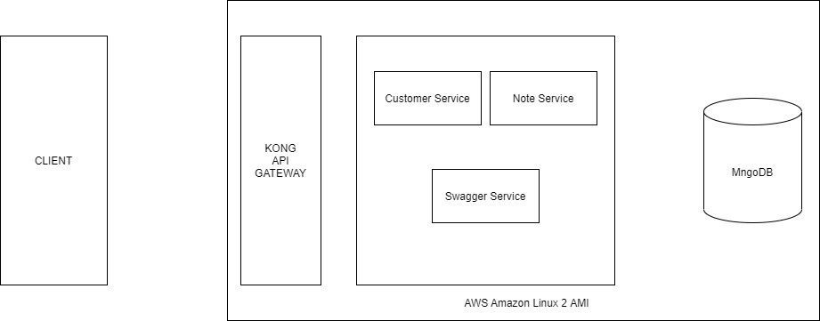

# backend-services
## Structure


with docker

1. Clone the repo
   ```sh
   git clone https://github.com/lakshitha212/backend-services.git
   ```
2. ``` cd backend-services ```
3. ``` docker image prune -f  ```
4. ``` docker-compose up --force-recreate --build -d  ```